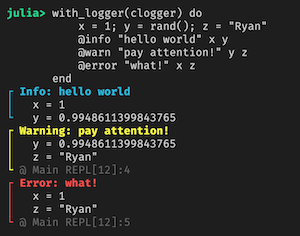

[](https://travis-ci.org/tk3369/LoggingFacilities.jl)
[](http://codecov.io/github/tk3369/LoggingFacilities.jl?branch=master)


# LoggingFacilities

This package provides an easy way to build transformer loggers as defined in
[LoggingExtras.jl](https://github.com/oxinabox/LoggingExtras.jl).

## Design

A standard log record consists of the following components:
- `level`: the logging level like Error, Warn, Info, and Debug
- `messasge`: a string
- `kwargs`: key-value pairs (where key is a Symbol)

In practice, the log output may need to be enhanced with additional information.
Further, it is conceivable that the data in these fields may need to be moved
around within the record.  For examples:

1. Prepend current timestamp to `message` or add it to `kwargs`
2. Format the log as a single line by moving all `kwargs` into `message`
3. Format the complete log record as a JSON string in `message` field
4. etc.

## Common Transformer Loggers

A few commonly used transformer loggers are provided as part of this package.
They can be accessed as follows.

### OneLineTransformerLogger

Migrate all kwargs fields by appending them to the message string.
```julia
julia> with_logger(OneLineTransformerLogger(current_logger())) do
           name = "Pluto"
           planet = false
           @info "hello world" name planet
       end
[ Info: hello world name=Pluto planet=false
```

### TimestampTransformerLogger

Add a timestamp at the beginnging or the end of the message string.
```julia
julia> with_logger(TimestampTransformerLogger(current_logger(), BeginningMessageLocation();
                                              format = "yyyy-mm-dd HH:MM:SSz")) do
           @info "hello"
       end

[ Info: 2020-07-04 21:00:58-07:00 hello
```

### JSONTransformerLogger

The JSONTransformerLogger is a little special in that it is expected to be used with
the `MessageOnlyLogger` sink (so that we can e.g. skip adding the log level as a prefix).

The `level` and `message` data are automatically
included within the JSON string, for which their labels are customizable. See doc string
for details.

```julia
julia> with_logger(JSONTransformerLogger(MessageOnlyLogger(); indent = 2)) do
           name = "Pluto"
           planet = false
           @info "hello world" name planet
       end
{
  "message": "hello world",
  "level": "Info",
  "name": "Pluto",
  "planet": false
}
```

### ColorMessageTransformerLogger

Color the message string based upon the log level.  Try it! :-)
```julia
julia> preferred_colors = Dict(
           Logging.Debug => ColorSpec(:grey, false),
           Logging.Info  => ColorSpec(:cyan, true),
           Logging.Warn  => ColorSpec(:yellow, true),
           Logging.Error => ColorSpec(:red, true),
       );

julia> clogger = ColorMessageTransformerLogger(current_logger(), preferred_colors);
```



### FixedMessageWidthTransformerLogger

Fix the width of the message string by padding spaces at the end. If the message string is longer
than the specified width, then it is truncated.

```julia
julia> logger = compose(
           current_logger(),
           logger -> FixedMessageWidthTransformerLogger(logger, 40),
           OneLineTransformerLogger,
       );

julia> with_logger(logger) do
           for i in 1:4
               x = round(rand(), digits = 10)
               y = round(rand(), digits = 10)
               @info "Iteration #$i" x y
           end
       end
[ Info: Iteration #1                             x=0.9901128795 y=0.7439288248
[ Info: Iteration #2                             x=0.7326098234 y=0.9881316083
[ Info: Iteration #3                             x=0.1050601631 y=0.2100138712
[ Info: Iteration #4                             x=0.2812764292 y=0.0242226631
```

## Creating your own transformer logger...

This is the whole reason why this package exists! :-)

There are 4 main operations in a transformer:

1. Inject - add data to the log record at either `message` or `kwargs` location.
2. Migrate - move data between `level`, `message`, or `kwargs`.
3. Mutate - mutate data in `level`, `message`, or `kwargs`
4. Remove - empty out `message` or remove all elements in `kwargs`.

Examples:

```julia
# Inject a timestamp to the beginning of the message
logger = TransformerLogger(current_logger()) do log
             inject(log, BeginningMessageLocation(), () -> now())
         end

# Inject a timestamp to the kwargs location
logger = TransformerLogger(current_logger()) do log
             inject(log, KwargsLocation(), () -> (:timestamp => now(),))
         end

# Migrate all kwargs to the message string
logger = TransformerLogger(current_logger()) do log
             migrate(log, KwargsProperty(), MessageProperty())
         end

# Multiple operations (using Pipe.jl)
logger = TransformerLogger(current_logger()) do log
             @pipe log |>
                   migrate(_log_, KwargsProperty(), MessageProperty())
                   inject(_, BeginningMessageLocation(), () -> now())
         end
```

## Credits

This package was originally conceived as part of [this coding live stream](https://www.youtube.com/watch?v=89xlkSUh_dA). Special credit to [Chris de Graff](https://github.com/christopher-dG) for joining
the live stream and helping out.

It has been redesigned significantly since v0.2.0.

